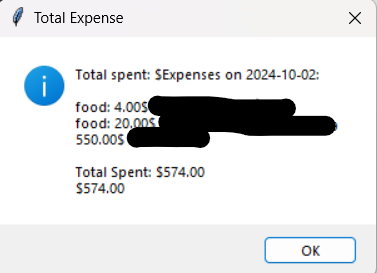

# trackyourbudget

# Monthly Budget Calculator with Expense Analysis


## Overview

This Python application is designed to help users manage their monthly budgets by recording and analyzing expenses. The program provides features to:

- Add expenses with descriptions and amounts
- Display the total amount spent
- Analyze expenses using graphical charts
- Clear the expense database
- Export expenses to an Excel file (.xlsx)
- Calculate and display the total expenses for a specific day

## Features

### 1. **Desctiption ares**
This area is used to write what did you pay for ? 
also here you need some keywords like:
'food', 'restaurant', 'groceries', 'meal'
'drink', 'water', 'coffee', 'beverage', 'juice'
'transport', 'bus', 'taxi', 'uber', 'gas', 'car'
'cloth', 'shopping', 'apparel'
'family', 'kids', 'school'
'health', 'hygene'
'House', 'buildings', "جمعية", "جمعيه"
'handout', 'charity', "صدقة", "صدقه"
'course', 'درس', 'كورس'


### 1. **Add Expense**

Users can enter a description of their expense and the amount spent. Once the "Add Expense" button is clicked, the expense is stored in an SQLite database along with the date and time it was added.


### 2. **Calculate Total**

The "Calculate Total" button allows users to calculate the total expenses recorded in the database. Additionally, the user can calculate the total expenses for a specific date by selecting the desired date.




### 3. **Analyze Expenses**

The "Analyze Expenses" button generates a bar chart showing the breakdown of expenses by category (e.g., food, drinks, transportation, etc.). The analysis helps users visualize which categories they are spending the most on.


### 5. **Export to Excel**

Users can export their expenses to an Excel file (.xlsx) by clicking the "Export to Excel" button. The user will be prompted to choose the file name and save location.


### 4. **Clear Database**

A red button labeled "Clear Database" allows users to delete all data from the SQLite database. The app will ask for confirmation before proceeding.
Yoou can use this button every month to reset your budget


## Getting Started

### Prerequisites

Make sure you have the following installed on your machine:

- Python 3.x
- `tkinter` (usually comes with Python)
- `openpyxl` (for exporting data to Excel)

You can install `openpyxl` by running:
```bash
pip install openpyxl
```

### Running the App

1. Clone the repository or download the project files.
2. Run the `main.py` file:
   ```bash
   python main.py
   ```

3. The application window will open, allowing you to start adding and analyzing your expenses.

## Files and Structure

- `main.py`: The main file containing the user interface and core functions.
- `analyze_expenses.py`: A separate file handling the expense analysis and chart generation.
- `budget.db`: SQLite database file where all expenses are stored.
- `README.md`: This file containing documentation and instructions for the app.
- `images/`: A folder with screenshots for reference in this `README`.

## Screenshots

Here are some additional screenshots to guide you through the app's interface and functionalities:

- **Adding an Expense** 
- **Expense Analysis** 
- **Export to Excel** 

## License

This project is licensed under the MIT License. Feel free to modify and distribute it.
