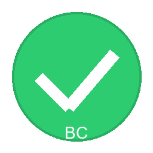

# 💰 Budget Calculator - Your Personal Finance Companion

> **Transform your financial life with the most intuitive budget management tool!**

## 🌟 Why Choose Budget Calculator?

### ✨ **Simple Yet Powerful**
- **No complex setup** - Start managing your money in minutes
- **Smart categorization** - Automatically sorts your expenses
- **Visual progress tracking** - See your budget status at a glance
- **One-click reporting** - Export insights to Excel instantly

### 🎯 **Perfect For Everyone**
- **Students** - Track daily expenses and manage allowances
- **Professionals** - Monitor spending and achieve financial goals
- **Families** - Organize household budgets and shared expenses
- **Small Businesses** - Track business expenses and cash flow

### 🚀 **Key Benefits**
- 💰 **Save Money** - Identify spending patterns and cut unnecessary expenses
- ⏰ **Save Time** - Automated categorization and reporting
- 📊 **Make Better Decisions** - Data-driven insights into your finances
- 🎯 **Achieve Goals** - Set and track financial objectives
- 🔒 **Privacy First** - Your data stays on your device

## 🎮 Getting Started in 3 Minutes

### Step 1: Download & Install
1. **Download** the installer from our website
2. **Run** `BudgetCalculatorSetup.exe`
3. **Follow** the simple installation wizard
4. **Launch** the application from your desktop

### Step 2: Set Your Budget
1. **Enter** your monthly budget amount
2. **Click** "Save" to set your budget
3. **Watch** the progress bar fill as you spend

### Step 3: Start Tracking
1. **Add** your first expense
2. **Describe** what you bought
3. **Enter** the amount
4. **Let** the app categorize it automatically

## 🎨 Beautiful & Intuitive Interface

### 🌓 **Choose Your Style**
- **Light Theme** - Clean and professional
- **Dark Theme** - Easy on the eyes
- **System Theme** - Matches your Windows settings

### 📱 **Modern Design**
- **Responsive Layout** - Works on any screen size
- **Intuitive Navigation** - Find features instantly
- **Visual Feedback** - Clear progress indicators
- **Smooth Animations** - Delightful user experience

## 🏷️ Smart Expense Categorization

### 🤖 **Automatic Detection**
The app learns from your spending patterns and automatically categorizes expenses:

- **Food & Dining** - Restaurants, groceries, coffee
- **Transportation** - Gas, public transport, rideshare
- **Shopping** - Clothes, electronics, household items
- **Entertainment** - Movies, games, subscriptions
- **Bills & Utilities** - Rent, electricity, internet
- **Healthcare** - Doctor visits, medications, insurance

### ✏️ **Custom Categories**
Create your own categories with personalized keywords:

1. **Click** "Manage Categories"
2. **Add** category name (e.g., "Gym Membership")
3. **Enter** keywords (e.g., "gym, fitness, workout")
4. **Save** and start using your custom category

## 📊 Powerful Analytics & Reporting

### 📈 **Visual Insights**
- **Spending Trends** - See how your expenses change over time
- **Category Breakdown** - Understand where your money goes
- **Budget Progress** - Track your monthly budget performance
- **Savings Analysis** - Identify opportunities to save more

### 📋 **Export Reports**
- **Excel Export** - Detailed reports for further analysis
- **PDF Reports** - Professional summaries for sharing
- **Custom Date Ranges** - Analyze any time period
- **Category Filters** - Focus on specific expense types

## 🎯 Advanced Features

### 🔍 **Smart Filtering**
- **Date Range** - Filter by any time period
- **Category** - Focus on specific expense types
- **Search** - Find expenses by description
- **Amount Range** - Filter by spending amount

### 💾 **Data Management**
- **Automatic Backup** - Your data is always safe
- **Data Export** - Take your data anywhere
- **Data Import** - Import from other apps
- **Cloud Sync** - Access from multiple devices (coming soon)

### ⚙️ **Customization**
- **Custom Categories** - Create unlimited categories
- **Theme Selection** - Choose your preferred appearance
- **Notification Settings** - Stay informed about your budget
- **Privacy Controls** - Control your data sharing

## 🏆 Success Stories

> *"I saved $500 in my first month using Budget Calculator! The automatic categorization helped me see where I was overspending."*  
> **- Sarah M., Marketing Manager**

> *"Finally, a budget app that actually works! The interface is so intuitive, and the reports are incredibly helpful."*  
> **- Mike R., Software Developer**

> *"As a student, this app helped me manage my limited budget perfectly. I can't imagine managing my finances without it!"*  
> **- Emma L., College Student**

## 🆚 Why Budget Calculator vs. Others?

| Feature | Budget Calculator | Other Apps |
|---------|------------------|------------|
| **Free** | ✅ Completely Free | ❌ Often Paid |
| **Privacy** | ✅ Local Data Storage | ❌ Cloud Required |
| **Offline** | ✅ Works Offline | ❌ Internet Required |
| **Custom Categories** | ✅ Unlimited | ❌ Limited |
| **Export Options** | ✅ Excel, PDF | ❌ Basic Only |
| **Theme Support** | ✅ Multiple Themes | ❌ Single Theme |
| **Performance** | ✅ Lightning Fast | ❌ Often Slow |

## 🎁 Bonus Features

### 🎯 **Goal Setting**
- Set monthly savings goals
- Track progress toward financial objectives
- Get notifications when you're on track
- Celebrate milestones with achievements

### 📱 **Mobile Companion** (Coming Soon)
- Sync data across devices
- Add expenses on the go
- Receive budget alerts
- View reports anywhere

### 🔔 **Smart Notifications**
- Budget alerts when approaching limits
- Weekly spending summaries
- Monthly budget reviews
- Goal achievement celebrations

## 🛡️ Privacy & Security

### 🔒 **Your Data, Your Control**
- **Local Storage** - All data stays on your device
- **No Cloud Required** - Works completely offline
- **No Tracking** - We don't collect personal information
- **Encryption** - Optional data encryption for extra security

### 🛠️ **Data Portability**
- **Export Anytime** - Take your data with you
- **Multiple Formats** - Excel, CSV, JSON support
- **Easy Migration** - Import from other apps
- **Backup Options** - Multiple backup strategies

## 🚀 Get Started Today!

### 📥 **Download Now**
1. **Click** the download button
2. **Run** the installer
3. **Start** managing your money better

### 💡 **Pro Tips for Success**
1. **Set Realistic Budgets** - Start with achievable goals
2. **Review Weekly** - Check your progress regularly
3. **Use Categories** - Organize your expenses properly
4. **Export Reports** - Analyze your spending patterns
5. **Stay Consistent** - Add expenses daily for best results

## 📞 Need Help?

### 🆘 **Support Options**
- **📧 Email**: aabdallah.atef.0x@gmail.com
- **📖 Documentation**: Check our comprehensive guides
- **💬 Community**: Join our user community
- **🐛 Bug Reports**: Report issues directly

### 📚 **Learning Resources**
- **Video Tutorials** - Step-by-step guides
- **FAQ Section** - Common questions answered
- **Best Practices** - Tips from successful users
- **Feature Guides** - Detailed feature explanations

---

## 🌟 **Join Thousands of Happy Users!**

**Download Budget Calculator today and take control of your financial future!**

---

  <strong>💰 Start Your Financial Journey Today! 💰</strong>

